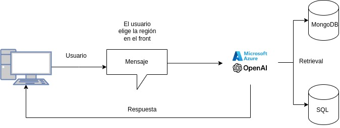

## Descripción del Proyecto

Este proyecto se enmarca en las elecciones de Alcalde, Gobernador, Consejero Regional (CORE) y Concejal, que se llevarán a cabo los días 26 y 27 de octubre de 2024 en Chile. El enfoque principal será en los candidatos a Gobernador, quienes, según lo establecido por la ley, deben presentar al Servicio Electoral de Chile (Servel) un archivo en formato PDF que contenga sus propuestas, proyectos e ideas para su respectiva región.

Lamentablemente, los demás cargos no cuentan con una exigencia similar de publicación formal de propuestas, lo que dificulta la recolección de información sobre ellos. En muchos casos, la única forma de acceder a los detalles sobre sus candidaturas es a través de técnicas como web scraping, o mediante la revisión de sus redes sociales y otras fuentes en línea. Sin embargo, es común que varios candidatos, especialmente alcaldes y otras autoridades, no dispongan de información detallada en la web, lo que complica obtener una biografía o un perfil completo de ellos.

Debido a estas limitaciones, este proyecto centrará su análisis principalmente en los candidatos a Gobernador y sus respectivas propuestas, dado que la información está formalmente disponible. La información del proyecto lo obtuve principalmente desde:

[Base de Conocimiento](https://www.emol.com/especiales/2024/nacional/elecciones2024/guia_candidatos.asp#!g3013)

## Objetivo del Proyecto

El objetivo principal de este proyecto es utilizar modelos de lenguaje de gran escala (LLM), aplicando técnicas de Recuperación Aumentada por Generación (RAG), para comparar las diferentes propuestas de los candidatos a Gobernador. La finalidad es ofrecer una herramienta que facilite a los votantes la elección del candidato que más se alinee con sus intereses y prioridades, según la región en la que deben votar.

**Demo**: [Enlace Demo](http://146.190.211.149:8501/)


**Consideración**: Se debe ingresar una API OpenAI para poder utilizar el Chat, ya que como no es gratuita la API, no pude dejar una API-key libre de uso. 

## ¿Cómo se realizo?

Creo que la mejor manera de explicarlo es a traves de un diagrama de flujo, el cual explica a grandes rasgo la logica de construcción del RAG:




## ¿Instalarlo localmente?

Si desea instalarlo en tu propio computador, el proyecto esta paquetizado dentro de un DockerFile, por lo que podrias facilmente instalar docker en tu computador, y luego construir la image y ejecutar el contenedor del proyecto de manera local. No obstante, esto no sería muy util, ya que no tendriás los acceso a la base de datos vectorial. No obstante, los comando para crear la imagen y ejecutar el DockerFile son:

```bash
sudo docker build -t my-streamlit-app .
```

Luego, el docker se ejecutan con:

```bash
sudo docker run -d -p 8501:8501 my-streamlit-app
```

